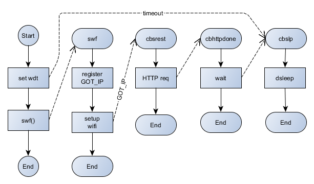

# A simple IoT temperature and humidity sensor for NodeMCU / Lua and submitting measurements by [RESTful API](https://en.wikipedia.org/wiki/Representational_state_transfer).

To use the code, copy init.default.lua to init.lua, and nodevars.default.lua to nodevars.lua and customise the latter to suit your needs.



The code supports HTTP GET and POST.

Example URLs for the REST host are:
* Thingspeak: http://api.thingspeak.com/update
* Emoncms: http://emoncms.org/input/post

Enter your own APIKEY as appropriate.

Edit the httpgetreq() definitition in init.lua to suit your REST host, eg:

* Thingspeak:
```
req=rest_url.."?field1="..temperature.."&field2="..humidity.."&api_key="..apikey
```

* Emoncms:
```
req="?node="..nodeid.."&csv="..temperature..","..humidity.."&apikey="..apikey
```
 
GET requests are usually fairly easy to get going, but you may find the RESTED add-in for Firefox and Chrome to be useful, also http://httpbin.org/get for testing.

The deep sleep function used depends on an external connection which you must make for it to work properly: connect a SB or germainium diode anode to RST, cathode to GPIO16 (D0).
 
Tested on:
```
NodeMCU custom build by frightanic.com
	branch: master
	commit: c8ac5cfb912ff206b03dd7c60ffbb2dafb83fe5e
	SSL: false
	modules: adc,dht,encoder,file,gpio,http,mqtt,net,node,ow,tmr,uart,wifi
 build 	built on: 2017-07-22 02:44
 powered by Lua 5.1.4 on SDK 2.1.0(116b762)
```
